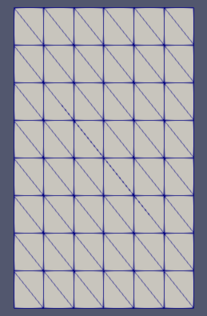
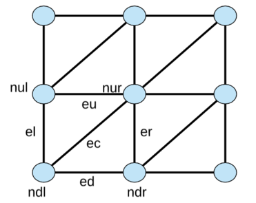

# triangle-grid-merge

## Why this project is useful

1. It helps to generate finite element triangular grid in tecplot format (.dat).

2. It's easy to read such a grid from tecplot (.dat) file.

3. Works for a multizone grids.

4. Able to merge multizone grids and write them as a single grid.

**The main advantage is that with tgm it's easy to read tecplot (.dat) format with multizone triangular grid inside and
connect zones basing on the coordinates of the nodes.**

## Quickstart

To **create** a grid
```
from triangular_grid_merge.grid import Grid
```
In order to initialize the grid with elements use:
```
grid.init(4, 5, (0, 60), (0, 100))
```
The code above creates a grid with 4 points by x-axis and 5 point by y-axis.
The points are distributed inside the rectangular given by the 2 points - `(x1, x2) (y1, y2)`

The area is devided according to the number of points by each axis.

To **print** the grid inside the tgm's grids directory, use
```
from triangular_grid_merge.tecplot import print_tecplot
print_tecplot(grid, 'name.dat')
```
If the grid is multizone you can print it as a single zone giving:
```
print_tecplot(grid, 'name.dat', merge=True)
```




To **read** a grid. use
```
from triangular_grid_merge.tecplot import read_tecplot
read_tecplot(grid, 'name.dat')
```

## Details

Triangular grid is the one where each face is set by three nodes. 
It consists of nodes, faces and edges.



